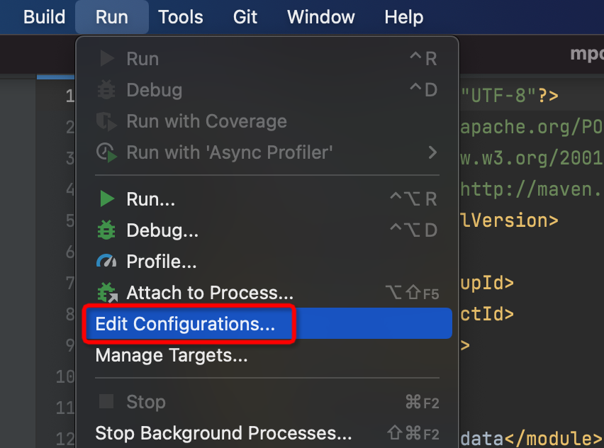
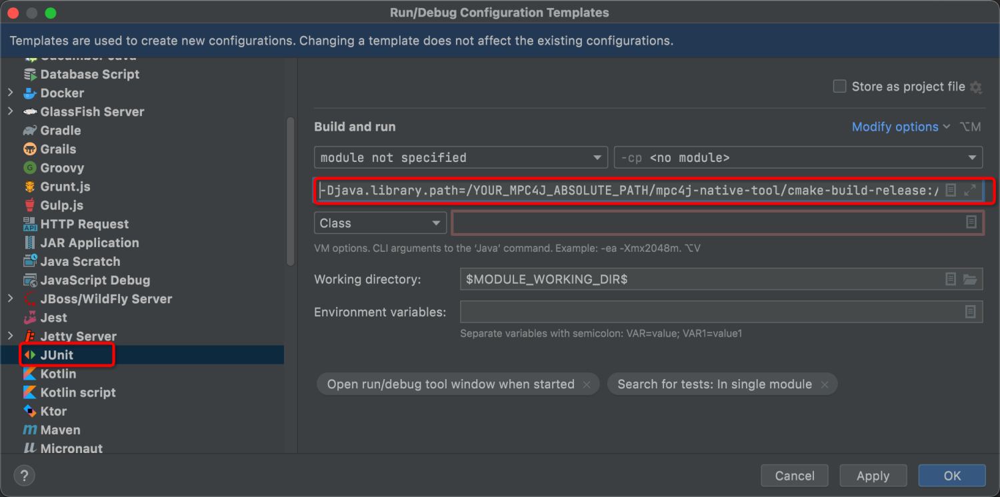
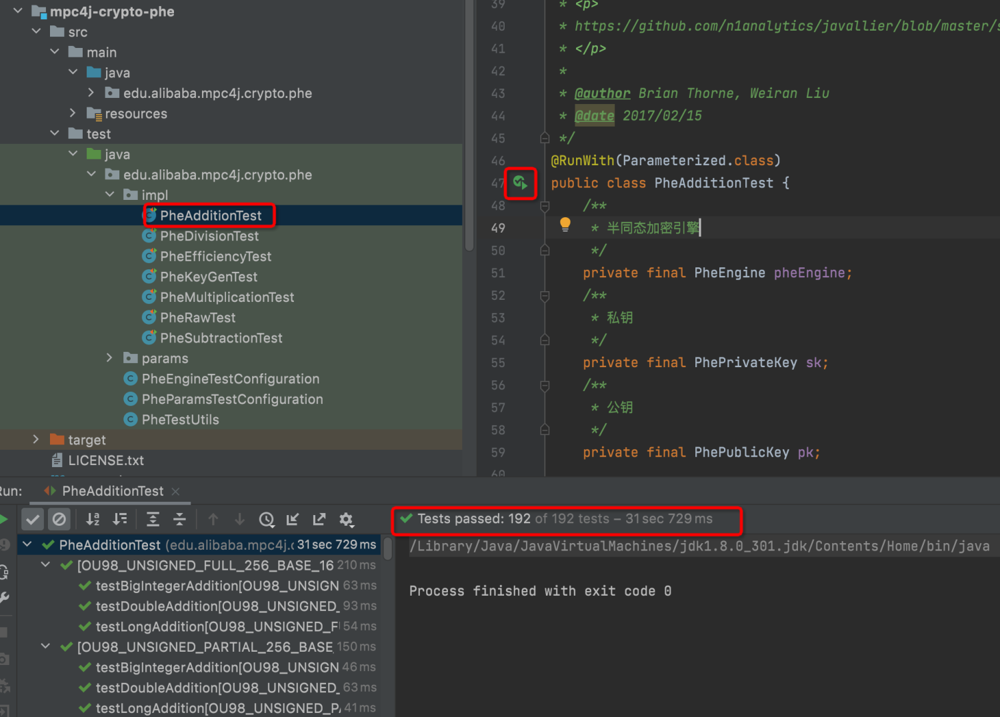

# mpc4j

## Introduction

Multi-Party Computation for Java (`mpc4j`) is an efficient and easy-to-use Secure Multi-Party Computation (MPC) and Differential Privacy (DP) library mainly written in Java.

`mpc4j` aims to provide an academic library for researchers to study and develop MPC/DP in a unified manner. As `mpc4j` tries to provide state-of-the-art MPC/DP implementations, researchers could leverage the library to have fair and quick comparisons between the new algorithms/protocols they proposed and existing ones.

We note that `mpc4j` is mainly focused on research and `mpc4j` assumes a very strong system model. Specifically, `mpc4j` assumes never-crash nodes with a fully synchronized network. In practice, crash-recovery nodes with a partially synchronized network would be a reasonable system model. Aside from the system model, `mpc4j` tries to integrate tools that are suitable to be used in the production environment. We emphasize that additional engineering problems need to be solved if you want to develop your own MPC/DP applications. A reasonable solution would be to implement communication APIs on your own, develop protocols by calling tools in `mpc4j`, and referring protocol implementations in `mpc4j` as a prototype.

### Features

`mpc4j` has the following features:

- **`aarch64` support**: `mpc4j` can run on both `x86_64` and `aarch64`. Researchers can develop and test protocols on Macbook M1 (`aarch64`) and then run experiments on Linux OS (`x86_64`). 
- **SM series support**: Developers may want to use SM series algorithms (SM2 for public-key operations, SM3 for hashing, and SM4 for block cipher operations) instead of regular algorithms (like secp256k1 for public-key operations, SHA256 for hashing, and AES for block cipher operations). Also, the SM series algorithms are accepted by ISO/IES, so it may be necessary to support SM series algorithms under MPC settings. `mpc4j` leverages [Bouncy Castle](https://www.bouncycastle.org/java.html) to support SM series algorithms.

### Contact

`mpc4j` is mainly developed by Weiran Liu. Feel free to contact me at [liuweiran900217@gmail.com](mailto:liuweiran900217@gmail.com). The submodules involving Fully Homomorphic Encryption (FHE) are mainly developed by [Liqiang Peng](mailto:shelleyatsun@gmail.com). The submodules involving Vector Oblivious Linear Evaluation (VOLE) are mainly developed by [Hanwen Feng](mailto:hanw.feng94@gmail.com). The components of TFHE are developed by [Zhen Gu](mailto: thuguz15@gmail.com) of Computing Technology Lab (CTL) in Damo, Alibaba. The rest of their TFHE implementation by extending SEAL will be later released in their FHE library.

### Who Uses `mpc4j`

Currently, [DataTrust](https://dp.alibaba.com/product/datatrust) is powered by `mpc4j`. If your project uses `mpc4j` and you do not mind it appearing here, don't hesitate to get in touch with me.

## Academic Implementations

## Some Implementations of our Works

Package `pmid` in `mpc4j-s2pc-pso` contains the implementation of our paper "Efficient Private Multiset ID Protocols and Applications to Private Multiset Operations" (manuscript). The configuration files are under `conf/pmid` in `mpc4j-s2pc-pso`. We are still updating the paper. We will release the final version when possible.

Our paper ["Linear Private Set Union from Multi-Query Reverse Private Membership Test"](https://eprint.iacr.org/2022/358.pdf) was accepted to USENIX Security 2023. Package `psu` in `mpc4j-s2pc-pso` contains the implementation of this paper. The configuration files are under `conf/psu` in `mpc4j-s2pc-pso`. Run `java -jar mpc4j-s2pc-pso-X.X.X-jar-with-dependencies.jar conf_file_name.txt` separately on two platforms with direct network connections (using the network channel assigned in config files) or on two terminals in one platform (using local network 127.0.0.1). Note that **you need first to run the server and then run the client. **The server and the client implicitly synchronize before running the protocol, and the first step is the client sends something like "hello" to the server. If the server is offline at that time, the program will get stuck.

Our paper ["OpBoost: A Vertical Federated Tree Boosting Framework Based on Order-Preserving Desensitization"](https://arxiv.org/abs/2210.01318) was accepted to VLDB 2023. Module `mpc4j-sml-opboost` contains the implementation of this paper. The configuration files are under `conf` in `mpc4j-sml-opboost`. Like `psu`, run `java -jar mpc4j-s2pc-pso-X.X.X-jar-with-dependencies.jar conf_file_name.txt` separately on two platforms with direct network connections (using the network channel assigned in config files) or on two terminals in one platform (using local network 127.0.0.1). Note that **you need first to run the server and then run the client. **

## Some Implementations of Existing Works

`mpc4j` contains some implementations of existing works, parts of which as listed below. We note that we rewrite some of the implementations to have a unified style.

- `mpc4j-common-sampler`

  - Canonne, Clément L., Gautam Kamath, and Thomas Steinke. The discrete gaussian for differential privacy. Advances in Neural Information Processing Systems 33 (2020): 15676-15688.
  - Daniele Micciancio, Michael Walter. Gaussian Sampling over the Integers: Efficient, Generic, Constant-Time. CRYPTO 2017, pp 455-485, 2017.
  - Thomas Pöppelmann, Léo Ducas, Tim Güneysu. Enhanced Lattice-Based Signatures on Reconfigurable Hardware. CHES 2014, pp 353-370, 2014.
  - Ducas, Léo, Alain Durmus, Tancrède Lepoint, and Vadim Lyubashevsky. Lattice signatures and bimodal Gaussians. CRYPTO 2013, pp. 40-56. Springer, Berlin, Heidelberg, 2013.

- `mpc4j-common-tool`

  - **Filter**
    - Vacuum Filter: Wang M, Zhou M, Shi S, et al. Vacuum filters: more space-efficient and faster replacement for bloom and cuckoo filters. Proceedings of the VLDB Endowment, 2019, 13(2): 197-210.
    - Cuckoo Filter: Fan B, Andersen D G, Kaminsky M, et al. Cuckoo filter: Practically better than bloom. CoNET 2014, pp. 75-88.
  - **crypto tools**
    - Kyber: Bos J, Ducas L, Kiltz E, et al. CRYSTALS - Kyber: A CCA-Secure Module-Lattice-Based KEM. EuroS&P 2018.
    - CRHF and TCRHF: Guo C, Katz J, Wang X, et al. Efficient and secure multiparty computation from fixed-key block ciphers. S&P 2020, pp. 825-841.
    - OKVS
      - Generalized OKVS: Pinkas B, Rosulek M, Trieu N, et al. PSI from PaXoS: Fast, Malicious Private Set Intersection. EUROCRYPT 2020. Springer, Cham, 2020, pp. 739-767. 
      - Mega-Bin: Pinkas B, Schneider T, Tkachenko O, et al. Efficient circuit-based PSI with linear communication. EUROCRYPT 2019. Springer, Cham, pp. 122-153.
      -  XePaXoS: Rindal P, Schoppmann P. VOLE-PSI: Fast OPRF and Circuit-PSI from Vector-OLE. EUROCRYPT 2021. Springer, Cham, pp. 901-930.

- `mpc4j-dp-service`

  - **Frequency Oracle with Local Differential Privacy**
    - Cormode, Graham, Samuel Maddock, and Carsten Maple. "Frequency estimation under local differential privacy. VLDB 2021, no. 11, pp. 2046-2058.
    - Acharya, Jayadev, Ziteng Sun, and Huanyu Zhang. Hadamard response: Estimating distributions privately, efficiently, and with little communication. AISATAS 2019, pp. 1120-1129. PMLR, 2019.
    - Wang, Tianhao, and Jeremiah Blocki. Locally differentially private protocols for frequency estimation. USENIX Security 2017.
    - Differential Privacy Team, Apple. Learning with Privacy at Scale. Technique Report, 2017.
    - Erlingsson U, Pihur V, Korolova A. RAPPOR: Randomized Aggregatable Privacy-Preserving Ordinal Response. CCS 2014, ACM, pp. 1054–1067.

  - Data Structure
    - Yang T, Gong J, Zhang H, et al. HeavyGuardian: Separate and Guard Hot Items in Data Streams. KDD 2018, ACM, pp. 2584–2593.

- `mpc4j-s2pc-pcg`

  - **Base OT**
    - Canetti R, Sarkar P, Wang X. Blazing Fast OT for Three-Round UC OT Extension. PKC 2020, Springer, 2020, pp. 299-327.
    - Mansy D, Rindal P. Endemic oblivious transfer. CCS 2019. 2019: 309-326.
    - McQuoid I, Rosulek M, Roy L. Batching base oblivious transfers. ASIACRYPT 2021, Springer, Cham, 2021: 281-310.
    - Chou T, Orlandi C. The simplest protocol for oblivious transfer. LATINCRYPT 2015, Springer, 2015, pp. 40-58.
    - Naor M, Pinkas B. Efficient Oblivious Transfer Protocols.SODA 2001, Society for Industrial and Applied Mathematics, 2001, pp. 448-457.
    - Beaver, Donald. Precomputing oblivious transfer. CRYPTO 1995, pp. 97-109. Springer, Berlin, Heidelberg, 1995.
  - **OT Extension and Silent OT** (without fixing malicious security problems in the paper "SoftSpokenOT: Communication – Computation Tradeoffs in OT Extension" accepted to CRYPTO 2022)
    - Geoffroy Couteau, Peter Rindal, Srinivasan Raghuraman. Silver: Silent VOLE and Oblivious Transfer from Hardness of Decoding Structured LDPC Codes. CRYPTO 2021, pp. 502-534. 2021.
    - Yang, Kang, Chenkai Weng, Xiao Lan, Jiang Zhang, and Xiao Wang. Ferret: Fast extension for correlated OT with small communication. CCS 2020, pp. 1607-1626.
    - Orru M, Orsini E, Scholl P. Actively Secure 1-out-of-N OT Extension with Application to Private Set Intersection. CT-RSA 2017, Springer, Cham, 2017: 381-396.
    - Keller M, Orsini E, Scholl P. Actively secure OT extension with optimal overhead. CRYPTO 2015, Springer, Berlin, Heidelberg, 2015, pp. 724-741.
    - Kolesnikov V, Kumaresan R. Improved OT Extension for Transferring Short Secrets. CRYPTO 2013, Springer, Berlin, Heidelberg, 2013, pp. 54-70.
    - Asharov G, Lindell Y, Schneider T, et al. More efficient oblivious transfer and extensions for faster secure computation. CCS 2013, ACM, 2013, pp. 535-548.
  - **Multiplication Triple Generation**
    - Rathee, Deevashwer, Thomas Schneider, and K. K. Shukla. Improved multiplication triple generation over rings via RLWE-based AHE. ACNS 2019, pp. 347-359. Springer, Cham, 2019.
    - Daniel Demmler, Thomas Schneider, Michael Zohner: ABY - A Framework for Efficient Mixed-Protocol Secure Two-Party Computation. NDSS 2015.

- `mpc4j-s2pc-pir`

  - **Index Private Information Retrieval**
    - FastPIR: Ishtiyaque Ahmad, Yuntian Yang, Divyakant Agrawal, Amr El Abbadi, and Trinabh Gupta. Addra: Metadata-private voice communication over fully untrusted infrastructure. In 15th USENIX Symposium on Operating Systems Design and Implementation, OSDI. 2021, 313-329
    - OnionPIR: Muhammad Haris Mughees, Hao Chen, and Ling Ren. XPIR : OnionPIR: Response Efficient Single-Server PIR. 2021 ACM SIGSAC Conference on Computer and Communications Security. 2021, 15–19
    - SealPIR: Sebastian Angel, Hao Chen, Kim Laine, and Srinath Setty. PIR with compressed queries and amortized query processing. In 2018 IEEE Symposium on Security and Privacy. 2018, 962–979
    - XPIR (re-implemented using SEAL): Carlos Aguilar Melchor, Joris Barrier, Laurent Fousse, and Marc-Olivier Killijian. XPIR: Private Information Retrieval for Everyone. Proc. Priv. Enhancing Technol. 2016, 2 (2016), 155–174.
  - **Keyword Private Information Retrieval (or Labeled PSI)**
    - Cong, Kelong, Radames Cruz Moreno, Mariana Botelho da Gama, Wei Dai, Ilia Iliashenko, Kim Laine, and Michael Rosenberg. Labeled psi from homomorphic encryption with reduced computation and communication. ACM CCS 2021, pp. 1135-1150. 2021.

- `mpc4j-s2pc-pso`

  - **Oblivious PRF and Private Set Intersection**
    - Chase M, Miao P. Private Set Intersection in the Internet Setting from Lightweight Oblivious PRF. CRYPTO 2020.
    - Resende A C D, Aranha D F. Faster unbalanced private set intersection. FC 2018. Springer, Berlin, Heidelberg, pp. 203-221.
    - Albreche M, Rechberger C, Schneider T, et al. Ciphers for MPC and FHE. EUROCRYPT 2015, Springer, Cham, pp. 430-454. 
    - Kolesnikov V, Kumaresan R, Rosulek M, et al. Efficient batched oblivious PRF with applications to private set intersection. CCS 2016, ACM, 2016, pp. 818-829.
    - C A Meadows. A more efficient cryptographic match-making protocol for use in the absence of a continuously available third party. S&P 1986, IEEE, 1986, pp. 134–137.
  - **Private Set Union**
    - Jia, Yanxue, Shi-Feng Sun, Hong-Sheng Zhou, Jiajun Du, and Dawu Gu. Shuffle-based Private Set Union: Faster and More Secure. USENIX Security 2022.
    - Garimella G, Mohassel P, Rosulek M, et al. Private Set Operations from Oblivious Switching. PKC 2021, Springer, Cham, pp. 591-617.
    - Kolesnikov V, Rosulek M, Trieu N, et al. Scalable private set union from symmetric-key techniques. ASIACRYPT 2019, pp. 636-666.

## References

`mpc4j` includes some implementation ideas and codes from the following open-source libraries.

### Included Libraries

Here are some libraries that are included in `mpc4j`.

- [smile](https://github.com/haifengl/smile): A fast and comprehensive machine learning, NLP, linear algebra, graph, interpolation, and visualization system in Java and Scala. We understand many details of implementing machine learning tasks from this library. We also introduce some codes into `mpc4j` for the dataset management and our privacy-preserving federated GBDT implementation. See packages `edu.alibaba.mpc4j.common.data` in `mpc4j-common-data` and package `edu.alibaba.mpc4j.sml.smile` in `mpc4j-sml-opboost` for details. Note that we introduce source codes that are released only under [the GNU Lesser General Public License v3.0 (LGPLv3)](https://www.gnu.org/licenses/lgpl-3.0.en.html).
- [Javallier](https://github.com/n1analytics/javallier): A Java library for [Paillier partially homomorphic encryption](https://en.wikipedia.org/wiki/Paillier_cryptosystem) based on [python-paillier](https://github.com/NICTA/python-paillier), with modifications to additionally support other schemes and optimizations. See `mpc4j-crypto-phe` for details.
- [JNA GMP project](https://github.com/square/jna-gmp): A JNA wrapper around the [GNU Multiple Precision Arithmetic Library](http://gmplib.org/). We modify the code for supporting the `aarch64` system. See `mpc4j-common-jna-gmp` for details.
- [Bouncy Castle](https://www.bouncycastle.org/java.html): A Java implementation of cryptographic algorithms, developed by the Legion of the Bouncy Castle, a registered Australian Charity. We understand many details of how to efficiently implement cryptographic algorithms using Java. We introduce its [X25519](https://github.com/bcgit/bc-java/blob/master/core/src/main/java/org/bouncycastle/math/ec/rfc7748/X25519.java) and [Ed25519](https://github.com/bcgit/bc-java/blob/master/core/src/main/java/org/bouncycastle/math/ec/rfc8032/Ed25519.java) implementations in `mpc4j` to support efficient Elliptic Curve Cryptographic (ECC) operations. See package `edu.alibaba.mpc4j.common.tool.crypto.ecc.bc` in `mpc4j-common-tool` for details.
- [Rings](https://rings.readthedocs.io): An efficient, lightweight library for commutative algebra. We understand how to efficiently do algebra operations from this library. We wrap its polynomial interpolation implementations in `mpc4j`. See package `edu.alibaba.mpc4j.common.tool.polynomial` in `mpc4j-common-tool` for details. We also provide `JdkIntegersZp` that uses [JNA GMP](https://github.com/square/jna-gmp) to implement operations in $\mathbb{Z}_p$. See `JdkIntegersZp` in `mpc4j-common-tool` for details.
- [blake2](https://github.com/BLAKE2/BLAKE2): Faster cryptographic hash function implementations. We introduce its original implementations and compare the efficiency with Java counterparts provided by [Bouncy Castle](https://www.bouncycastle.org/java.html) and other hash functions (e.g., [blake3](https://github.com/BLAKE3-team/BLAKE3)). See `crypto/blake2` in `mpc4j-native-tool` for details.
- [blake3](https://github.com/BLAKE3-team/BLAKE3): Much faster cryptographic hash function implementations. We introduce its original implementations and compare the efficiency with Java counterparts provided by [Bouncy Castle](https://www.bouncycastle.org/java.html) and other hash functions (e.g., [blake2](https://github.com/BLAKE2/BLAKE2)). See `crypto/blake3` in `mpc4j-native-tool` for details.
- [emp-toolkit](https://github.com/emp-toolkit): Efficient bit-matrix transpose (See `bit_matrix_trans` in `mpc4j-native-tool`), AES-NI implementations (See `crypto/aes.h` in `mpc4j-native-tool`), efficient $GF(2^\kappa)$ operations (See `gf2k` in `mpc4j-native-tool`).
- [KyberJCE](https://github.com/fisherstevenk/kyberJCE): Kyber is an IND-CCA2-secure key encapsulation mechanism (KEM), whose security is based on the hardness of solving the learning-with-errors (LWE) problem over module lattices. KyberJCE is a pure-Java implementation of Kyber. We introduce its Kyber implementation in `mpc4j` for supporting post-quantum secure oblivious transfer. See `crypto/kyber` in `mpc4j-native-tool` for details.
- [xgboost-predictor](https://github.com/h2oai/xgboost-predictor): Pure Java implementation of [XGBoost](https://github.com/dmlc/xgboost/) predictor for online prediction tasks. This work is released under the [Apache Public License 2.0](http://www.apache.org/licenses/LICENSE-2.0). We understand the format of the XGBoost model from this library. We also introduce some codes in `mpc4j` for our privacy-preserving federated XGBoost implementation. See packages `ai.h2o.algos.tree` and `biz.k11i.xgboost` in `mpc4j-sml-opboost` for details.
- [curve25519-elisabeth](https://github.com/cryptography-cafe/curve25519-elisabeth): A pure-Java implementation of group operations on Curve25519. We introduce its ED25519 and [Ristretto](https://ristretto.group/) implementation in `mpc4j `. See package `crypto/ecc/cafe` for details.

### Inspired Libraries

Here are some libraries that inspire our implementations.

- [mobile_psi_cpp](https://github.com/contact-discovery/mobile_psi_cpp): A C++ library implementing several OPRF protocols and using them for Private Set Intersection. We introduce its LowMC parameters and encryption implementations in `mpc4j`. See `edu.alibaba.mpc4j.common.tool.crypto.prp.JdkBytesLowMcPrp` and `edu.alibaba.mpc4j.common.tool.crypto.prp.JdkLongsLowMcPrp` in `mpc4j-common-tool` for details.
- [emp-toolkit](https://github.com/emp-toolkit): We follow the implementation of the Silent OT protocol presented in the paper "Ferret: Fast Extension for coRRElated oT with Small Communication," accepted at [CCS 2020](https://eprint.iacr.org/2020/924.pdf) (See `cot` in `mpc4j-s2pc-pcg`).
- [Kunlun](https://github.com/yuchen1024/Kunlun): A C++ wrapper for OpenSSL, making it handy to use without worrying about cumbersome memory management and memorizing complex interfaces. Based on this wrapper, Kunlun builds an efficient and modular crypto library. We introduce its OpenSSL wrapper for Elliptic Curve and the Window Method implementation in `mpc4j`, see `ecc_openssl` in `mpc4j-native-tool` for details. 
- [PSI-analytics](https://github.com/osu-crypto/PSI-analytics): The implementation of the protocols presented in the paper "Private Set Operations from Oblivious Switching," accepted at [PKC 2021](https://eprint.iacr.org/2021/243.pdf). We introduce its switching network implementations in `mpc4j`. See package `benes_network` in `mpc4j-native-tool` for details.
- [Diffprivlib](https://github.com/IBM/differential-privacy-library): A general-purpose library for experimenting with, investigating, and developing applications in differential privacy. We understand how to organize source codes for implementing differential privacy mechanisms. See `mpc4j-dp-cdp` for details.
- [b2_exponential_mchanism](https://github.com/cilvento/b2_exponential_mechanism): An exponential mechanism implementation with base-2 differential privacy. We re-implement the base-2 exponential mechanism in `mpc4j`. See package `edu.alibaba.mpc4j.dp.cdp.nomial` for details.
- [libOTe](https://github.com/osu-crypto/libOTe): Implementations for many Oblivious Transfer (OT) protocols, especially the Silent OT protocol presented in the paper "Silver: Silent VOLE and Oblivious Transfer from Hardness of Decoding Structured LDPC Codes" accepted at [CRYPTO 2021](https://eprint.iacr.org/2021/1150.pdf) (See package `cot` in `mpc4j-s2pc-pcg`).
- [PSU](https://github.com/osu-crypto/PSU): The implementation of the paper "Scalable Private Set Union from Symmetric-Key Techniques," published in [ASIACRYPT 2019](https://eprint.iacr.org/2019/776.pdf). We introduce its fast polynomial interpolation implementations in `mpc4j`. See package `ntl_poly` in `mpc4j-native-tool` for details. The PSU implementation is in package `psu` of `mpc4j-s2pc-pso`.
- [PSU](https://github.com/dujiajun/PSU): The implementation of the paper "Shuffle-based Private Set Union: Faster and More," published in [USENIX Security 2022](https://eprint.iacr.org/2022/157.pdf). We introduce the idea of how to concurrently run the Oblivious Switching Network (OSN) in `mpc4j`. See package `psu` in `mpc4j-s2pc-pso` for details.
- [SpOT-PSI](https://github.com/osu-crypto/SpOT-PSI): The implementation of the paper "SpOT-Light: Lightweight Private Set Intersection from Sparse OT Extension," published in [CRYPTO 2019](https://eprint.iacr.org/2019/634.pdf). We introduce many ideas for fast polynomial interpolations in `mpc4j`. See package `polynomial` in `mpc4j-common-tool` for details.
- [OPRF-PSI](https://github.com/peihanmiao/OPRF-PSI): The implementation of the paper "Private Set Intersection in the Internet Setting From Lightweight Oblivious PRF," published in [CRYPTO 2020](https://eprint.iacr.org/2020/729.pdf). We introduce its OPRF implementations in `mpc4j`. See `oprf` in `mpc4j-s2pc-pso` for details.
- [APSI](https://github.com/microsoft/APSI): The implementation of the paper "Labeled PSI from Homomorphic Encryption with Reduced Computation and Communication," published in [CCS 2021](https://eprint.iacr.org/2021/1116.pdf). For its source code, we understand how to use the Fully Homomorphic Encryption (FHE) library [SEAL](https://github.com/microsoft/SEAL). Most of the codes for Unbalanced Private Set Intersection (UPSI) are partially from ASPI. We also adapt the encoding part of [6857-private-categorization](https://github.com/aleksejspopovs/6857-private-categorization) to support arbitrary bit-length elements. See `mpc4j-native-fhe` and `upsi` in `mpc-s2pc-pso` for details.
- [MiniPSI](https://github.com/osu-crypto/MiniPSI): The implementation of the paper "Compact and Malicious Private Set Intersection for Small Sets," published in [CCS 2021](https://eprint.iacr.org/2021/1159). We understand how to implement Elliagtor encoding/decoding functions on Curve25519. See package `crypto/ecc/bc/X25519BcByteMulElligatorEcc` in `mpc4j-common-tool` for details.
- [Ed25519](https://github.com/agl/ed25519/tree/5312a61534124124185d41f09206b9fef1d88403): Ed25519 in for Go. We understand how to implement Elliagtor in Ed25519. See package `crypto/ecc/bc/X25519BcByteMulElligatorEcc` in `mpc4j-common-tool` for details.
- [dgs](https://github.com/malb/dgs): Discrete Gaussians over the Integers. We learn many ways of discrete Gaussian sampling. See package `common/sampler/integral/gaussian` in `mpc4j-common-sampler` for details.
- [Pure-DP](https://github.com/Samuel-Maddock/pure-LDP): a Python package that provides simple implementations of various state-of-the-art LDP algorithms (both Frequency Oracles and Heavy Hitters) with the main goal of providing a single, simple interface to benchmark and experiment with these algorithms. We learn many efficient LDP implementation details.

## Acknowledge

We thank [Prof. Benny Pinkas](http://www.pinkas.net/) and [Dr. Avishay Yanai](https://www.yanai.io/) for many discussions on implementing Private Set Intersection protocols. They also greatly help our Java implementations for Oblivious Key-Value Storage (OKVS) presented in the paper "Oblivious Key-Value Stores and Amplification for Private Set Intersection," accepted at [CRYPTO 2021](https://eprint.iacr.org/2021/883.pdf). See package `okve/okvs` in `mpc4j-common-tool` for more details.

We thank [Dr. Stanislav Poslavsky](https://www.linkedin.com/in/stanislav-poslavsky-231311163) and [Prof. Benny Pinkas](http://www.pinkas.net/) for many discussions on implementations of fast polynomial interpolations when we try to implement the PSI protocol presented in the paper "SpOT-Light: Lightweight Private Set Intersection from Sparse OT Extension."

We thank [Prof. Mike Rosulek](https://web.engr.oregonstate.edu/~rosulekm/) for the discussions about the implementation of Private Set Union (PSU). Their implementation for the paper "Private Set Operations from Oblivious Switching" brings much help for us to understand how to implement PSU.

We thank [Prof. Xiao Wang](https://wangxiao1254.github.io/) for discussions about fast bit-matrix transpose. From the discussion, we understand that the basic idea of fast bit-matrix transpose is from the blog [The Full SSE2 Bit Matrix Transpose Routine](https://mischasan.wordpress.com/2011/10/03/the-full-sse2-bit-matrix-transpose-routine/). He also helped me realize that there exists an efficient polynomial operation implementation in $GF(2^\kappa)$ introduced in [Intel Carry-Less Multiplication Instruction and its Usage for Computing the GCM Mode](https://www.intel.com/content/dam/develop/external/us/en/documents/clmul-wp-rev-2-02-2014-04-20.pdf). See package `galoisfield/gf2k` in `mpc4j-common-tool` for more details.

We thank [Prof. Peihan Miao](https://www.linkedin.com/in/peihan-miao-08919932/) for discussions about the implementation of the paper "Private Set Intersection in the Internet Setting From Lightweight Oblivious PRF." From the discussion, we understand there is a special case for the lightweight OPRF when $n = 1$. See package `oprf` in `mpc4j-s2pc-pso` for more details.

We thank [Prof. Yu Chen](https://yuchen1024.github.io/) for many discussions on various MPC protocols. Here we recommend his open-source library [Kunlun](https://github.com/yuchen1024/Kunlun), a modern crypto library. We thank [Minglang Dong](https://github.com/minglangdong) for her example codes about implementing [the Window Method](https://www.geeksforgeeks.org/window-sliding-technique/) for fixed-base multiplication in ECC. 

We thank [Dr. Bolin Ding](https://www.bolin-ding.com/) for many discussions on introducing MPC into the database field. Here we recommend the open-source library [FederatedScope](https://federatedscope.io/), an easy-to-use federated learning package, from his team.

We thank anonymous USENIX Security 2023 Artifact Evaluation (AE) reviewers for many suggestions for the `mpc4j` documentation and for `mpc4j-native-tool`. These suggestions help us fix many memory leakage problems. Also, the comments help us remove many duplicate codes.

## License

This library is licensed under Apache License 2.0.

## Specifications

### C/C++ Modules

Most of the codes are in Java, except for very efficient implementations in C/C++. You need [OpenSSL](https://www.openssl.org/), [GMP](https://gmplib.org/), [NTL](https://libntl.org/) , [MCL](https://github.com/herumi/mcl), and [libsodium](https://doc.libsodium.org/installation) to compile `mpc4j-native-tool` and [SEAL 4.0.0](https://github.com/microsoft/SEAL) to compile `mpc4j-native-fhe`. Please see READMD.md in `mpc4j-native-cool` and `mpc4j-native-fhe` on how to install C/C++ dependencies.

After successfully obtaining the compiled C/C++ libraries (named `libmpc4j-native-tool` and `libmpc4j-native-fhe`, respectively), you need to assign the native library location when running `mpc4j` using `-Djava.library.path`.

### Tests

`mpc4j` has been tested on MAC (`x86_64` / `aarch64`), Ubuntu 20.04  (`x86_64` / `aarch64`), and CentOS 8 (`x86_64`). We welcome developers to do tests on other platforms. 

### Performances

We have received a lot of suggestions and some performance reports from users. We thank [Dr. Yongha Son](https://github.com/yonghaason) for providing performance reports for Private Set Union (PSU) on his development platform (Intel Xeon 3.5GHz) under the **Unit Test**. He reported that:

> Well, I tested other protocols, particularly [JSZ22 SFC](https://eprint.iacr.org/2022/157.pdf), [GMR21](https://eprint.iacr.org/2021/243.pdf), and [KRTW19](https://eprint.iacr.org/2019/776.pdf), from unit tests.
>
> - JSZ22 takes 4x faster time.
>
> - KRTW19 and GMR21 take 1.5x slower.
> - ZCL22 takes 2.5-3x slower time.
>
> than the reported numbers in ZCL22.

We have a deep discussion about the performance gap. Here are the following reasons:

1. In **Unit Test**, we use an optimized way of implementing JSZ22. Roughly speaking, we can use batched related-key OPRF proposed by [Kolesnikov et al.](https://eprint.iacr.org/2016/799.pdf) instead of the more general multi-point OPRF proposed by [Chase and Miao](https://eprint.iacr.org/2020/729.pdf) to speed up the underlying OPRF. The reason is that JSZ22 used cuckoo hash binning the input elements, suitable for related-key OPRF. See our paper ["Private Set Operations from Multi-Query Reverse Private Membership Test"](https://eprint.iacr.org/2022/652.pdf) for more details.
2. As far as we know, server-version CPUs (like Intel Xeon 3.5GHz) provide more efficient instructions than desktop-version CPUs (like Intel i9900k). Note that NTL and GMP would automatically detect the underlying platform to choose the most efficient way for their configurations. We **doubt** these instructions would help NTL and GMP libraries run faster. It seems that such efficient instructions would bring little help to ECC operations. As a comparison, Dr. Yongha Son ran `EccEfficiencyTest` on his platform. The result shows ECC operations on his platform with `asm` are much slower (about 5x) than on our Macbook M1 platform without `asm`.

We have to say that we underestimated the performance gap between different platforms. The performance comparison result also reflects that having fair comparisons for different protocols is very challenging. Aside from that, we still try to provide a unified library for trying to have a relatively fair comparison.

### Notes for Running on `aarch64` 

When using or developing `mpc4j` on `aarch64` systems (like MacBook M1),  you may get `java.lang.UnsatisfiedLinkError` with a description like "no mpc4j-native-tool / mpc4j-native-fhe in java.library.path", even if you correctly compile the native libraries and config the native library paths using `-Djava.library.path`. The reason is that **some Java Virtual Machines (JVM) with versions less than 17 do not fully support `aarch64`**. [JDK 17 Release Notes](https://www.oracle.com/java/technologies/javase/17-relnote-issues.html) stated that (In JEP 391: macOS / Aarch64 Port):

> macOS 11.0 now supports the AArch64 architecture. This JEP implements support for the macos-aarch64 platform in the JDK. One of the features added is support for the W^X (write xor execute) memory. It is enabled only for macos-aarch64 and can be extended to other platforms at some point. The JDK can be either cross-compiled on an Intel machine or compiled on an Apple M1-based machine.

We recommend using Java 17 (or higher versions) to run or develop `mpc4j` on `aarch64` systems. If you still want to use Java with versions less than 17, we test many JVMs and found that [Azul Zulu](https://www.azul.com/downloads/) fully supports `aarch64`.

## Development

### Development Guideline

We develop `mpc4j` using [Intellij IDEA](https://www.jetbrains.com/idea/) and [CLion](https://www.jetbrains.com/clion/). After successfully compiling `mpc4j-native-tool` and `mpc4j-native-fhe`, you need to configure IDEA with the following procedures so that IDEA can link to these native libraries.

1. Open `Run->Edit Configurations...`
2. Open `Edit Configuration templates...`
3. Select `JUnit`.
4. Add the following command into `VM Options`:

```text
-Djava.library.path=/YOUR_MPC4J_ABSOLUTE_PATH/mpc4j-native-tool/cmake-build-release:/YOUR_MPC4J_ABSOLUTE_PATH/mpc4j-native-fhe/cmake-build-release
```

### Demonstration

We thank [Qixian Zhou](https://github.com/qxzhou1010) for writing a guideline demonstrating configuring the development environment on macOS (x86_64). We believe this guideline can also be used for other platforms, e.g., macOS (M1), Ubuntu, and CentOS. Here are the steps:

1. Follow any guidelines to install JDK 8 and IntelliJ IDEA. If you successfully install JDK8, you can obtain similar information in the terminal when executing `java -version`.

```text
java version "1.8.0_301"
Java(TM) SE Runtime Environment (build 1.9.0_301-b09)
Java HotSpot(TM) 64-Bit Server VM (build 25.301-b09, mixed mode)
```

2. Clone `mpc4j` source code using `git clone https://github.com/alibaba-edu/mpc4j.git`.

3. Follow the documentation in https://github.com/alibaba-edu/mpc4j/tree/main/mpc4j-native-tool to compile `mpc4j-native-tool`. If all steps are correct, you will see:

```text
[100%] Linking CXX shared library libmpc4j-native-tool.dylib
[100%] Built target mc4j-native-tool
```

4. Follow the documentation in https://github.com/alibaba-edu/mpc4j/tree/main/mpc4j-native-fhe to compile `mpc4j-native-tool`. If all steps are correct, you will see:

```
[100%] Linking CXX shared library libmpc4j-native-fhe.dylib
[100%] Built target mc4j-native-fhe
```

5. Using IntelliJ IDEA to open `mpc4j`.
6. Open `Run->Edit Configurations...`.



7. Open `Edit Configuration templates...`.


8. Select `JUnit`, and add the following command into `VM Options` (**Note that you must replace  `/YOUR_MPC4J_ABSOLUTE_PATH` with your own absolute path for `libmpc4j-native-tool.dylib` and `libmpc4j-native-fhe.dylib`**.):

```shell
-Djava.library.path=/YOUR_MPC4J_ABSOLUTE_PATH/mpc4j-native-tool/cmake-build-release:/YOUR_MPC4J_ABSOLUTE_PATH/mpc4j-native-fhe/cmake-build-release
```



9. Now, you can run tests of any submodule by pressing the **Green Arrows** showing on the left of the source code in test packages. 



## TODO List

### Possible Missions

- Provide more documentation.
- Translate JavaDoc and comments in English.
- We are still adjusting our implementations on many Private Set Intersection protocols. We will soonly release the source code whenever available.
- More secure two-party computation (2PC) protocol implementations.
- More secure three-party computation (3PC) protocol implementations. Specifically, release the source code of our paper "Scape: Scalable Collaborative Analytics System on Private Database with Malicious Security" accepted at [ICDE 2022](https://ieeexplore.ieee.org/document/9835540/). 
- More differentially private algorithms and protocols, especially for the Shuffle Model implementations of our paper ["Privacy Enhancement via Dummy Points in the Shuffle Model."](https://arxiv.org/abs/2009.13738)

### Impossible Missions, but We Will Try

- What about implementing ["Deep Learning with Differential Privacy"](https://arxiv.org/abs/1607.00133) and its following works using Java, e.g., based on [Deep Java Library](https://djl.ai/)?
- (Suggested by [Prof. Joe Near](https://www.uvm.edu/~jnear/)) What about implementing Distributed Noise Generation protocols, like ["Our Data, Ourselves: Privacy via Distributed Noise Generation"](https://link.springer.com/content/pdf/10.1007/11761679_29.pdf)?